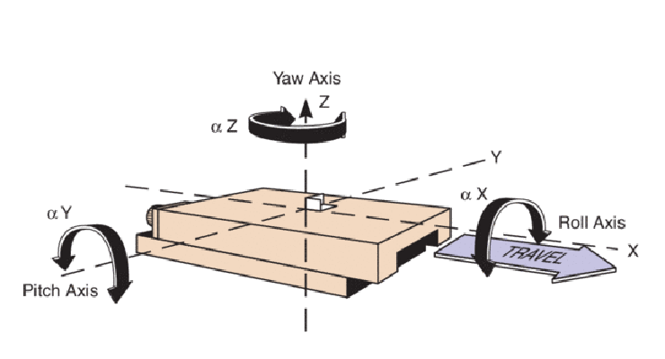
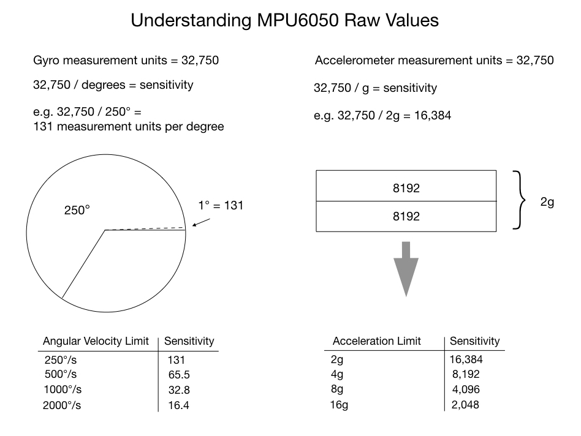

## 一、roll yaw pitch 方向圖


## 二、改的地方
### arduino 內修改
1. 參考 [MPU 6050 設計手冊](https://mjwhite8119.github.io/Robots/mpu6050) ， 我們須將 Angular Velocity Limit 設為 250 度/s ， Acceleration Limit 設為 2G 會有最大 sensitivity。


### python 內修改
2. gyr 加入過濾 
    ```python
    gyr1 = apply_deadzone(gyr1, 0.1)
    gyr2 = apply_deadzone(gyr2, 0.1)
    gyr3 = apply_deadzone(gyr3, 0.1)
    ```
3. madgwick beta 設為
    ```python
    # ==== Madgwick 初始化 ====
    madgwick1 = Madgwick(beta=0.3)
    madgwick2 = Madgwick(beta=0.4)
    madgwick3 = Madgwick(beta=0.5)
    ```
4. 程式邏輯錯誤 : Madgwick 演算法算出來的 Quaternion (或是你轉成的 Roll 角度)，是 「相對於世界座標 (重力)」的絕對角度。改用「絕對姿態」直接控制，旋轉 (Rotation) 各自獨立： Box2 的角度直接由 IMU2 決定。
    ```git
    - # ---- 合成世界 quaternion ----
    - q1q2   = quat_mul(q1c, q2c)
    - q1q2q3 = quat_mul(q1q2, q3c)
    - # ---- 套用到 VPython ----
    - apply_quat(imu1_box, q1c)
    - apply_quat(imu2_box, q1q2)
    - apply_quat(imu3_box, q1q2q3)

    + apply_quat(imu1_box, q1c)
    + apply_quat(imu2_box, q2c)
    + apply_quat(imu3_box, q3c)
    ```
5. (已修好) TCA9548A VCC 斷掉，導致第六點
6. (已修好) IMU2/IMU3 偵測不到

## 三、 待作事項
1. 改完 二之4 還未調參數
